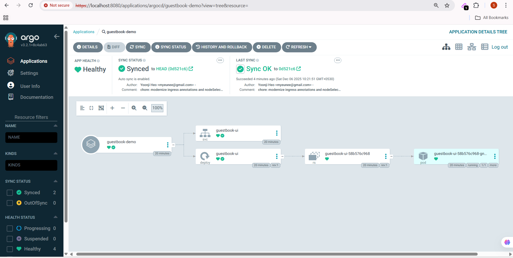
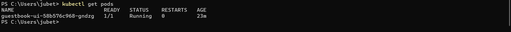
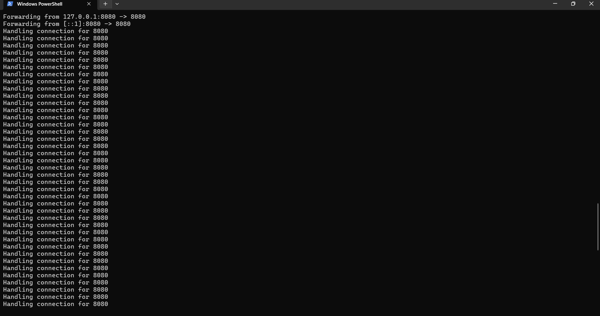

# GitOps Project: Guestbook Application with Argo CD

This project demonstrates a fully automated **GitOps workflow** using **Argo CD** to deploy a Guestbook application on Kubernetes. It showcases my ability to manage infrastructure, troubleshoot deployments, and implement Continuous Delivery (CD).

## 🚀 Project Overview
* **Goal:** Automate the deployment of a frontend application using declarative GitOps principles.
* **Tools:** Kubernetes, Docker, Argo CD, Git.
* **Outcome:** Successfully synced application state from Git to the cluster with self-healing capabilities.

## 📸 Proof of Deployment

### 1. Argo CD Dashboard (Success State)
*The application is fully synced with the Git repository and in a healthy state.*


### 2. Kubernetes CLI Verification
*Verifying that Pods are Running and Ready (1/1).*


### 3. Application Access
*Successfully accessing the application via port-forwarding.*


## 🛠️ Technical Challenges & Solutions
During this deployment, I encountered a `ContainerCreating` error where the Pod failed to start.
* **Issue:** The Pod was stuck in a pending state.
* **Troubleshooting:** I analyzed the Pod events using `kubectl describe` and identified a configuration mismatch in the ingress annotations.
* **Resolution:** I modernized the ingress annotations and updated the `nodeSelector` in the deployment manifest. Once pushed to Git, Argo CD automatically synced the fix, resolving the error.

## 💻 How to Run
1. Install Argo CD on your cluster.
2. Apply the application manifest:
   ```bash
   kubectl apply -f application.yaml